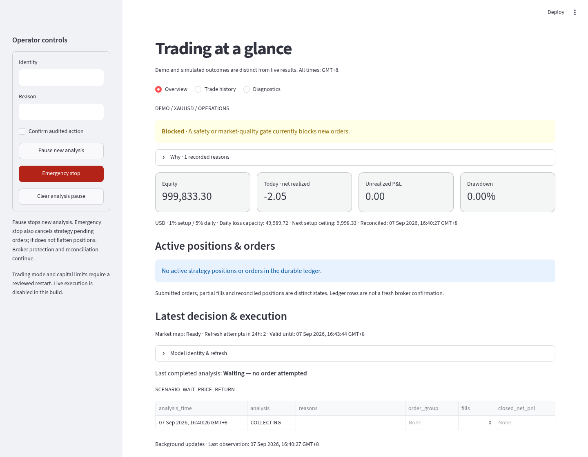

# cTrader scalper

A Debian-compatible, AI-assisted XAUUSD analysis and execution system. The model
proposes prices; deterministic code controls money, validation and execution.
**Live submission is disabled. The tested strategies have not demonstrated
positive net expectancy.**

The current source release is `0.2.2-fixed-risk.3`, policy `fixed-risk-v2`.
The model creates a reusable five-minute chart map with `scenario-v2` / schema
`scenario-1.0`; local code derives protected OCO proposals using
`scenario-execution-v1` and the unchanged strict schema `2.1`.
See the [current risk-policy and rollout report](docs/fixed-risk-report.md) and
[scenario implementation evidence](docs/reusable-scenario-report.md).

The original [completed-candle directional research](docs/scenario-automation-report.md)
remains a separate observe/replay tool. Its hold/failed-reclaim confirmations and
simulated structural/time closes are not the production OCO trigger rule.
`npm run scenario:observe -- artifacts/scenario-observation.json` makes one
potentially chargeable observation without broker submission authority.
`npm run scenario:replay -- tests/fixtures/scenario/manual-levels-synthetic.json artifacts/scenario-replay.json`
is a synthetic software check, not evidence of strategy performance.

## Overview



The Streamlit dashboard has **Overview**, **Trade history**, and **Diagnostics**.
Overview shows operating state and reasons, fresh equity and net P&L, drawdown,
remaining budget, active exposure and the latest decision/execution. Read-only
snapshots refresh in a background worker every ten seconds; small live sections
update independently while navigation and control inputs stay in place.
Light and dark themes retain readable contrast. Financial observations older
than 30 seconds are withheld.
The overview screenshots show the current fixed-risk policy. Money values use
the policy reported by execution; missing policy data is shown as unavailable.
Prompts, analytics, provider details and infrastructure live in diagnostics.
Authenticated pause and emergency controls remain available in the sidebar.

[Trade history screenshot](docs/images/dashboard-history.png)

[Dark theme screenshot](docs/images/fixed-risk-overview-dark.png) ·
[Refresh and contrast validation](docs/dashboard-refresh-report.md)

## Safety and money management

- Paper is the default mode; emergency stop starts active and automation is off.
  Credentials never authorize demo or live trading.
- One strategy setup at a time. Other-symbol account exposure, partial fills,
  unknown orders and incomplete reconciliation block new risk. Manual orders
  are never cancelled. Maintenance selects only the configured account/symbol.
- The fixed policy permits **up to 1% total setup risk** and **5% daily loss**.
  It retains the **1% margin ceiling** and **10-point
  absolute spread ceiling**, alongside ATR/percentile spread checks. Both OCO
  legs share the setup budget, including simultaneous-fill race exposure.
- Sizing reserves round-trip commission and ten ticks of adverse execution,
  floors broker-native volume, and respects notional and remaining daily limits.
  No absolute starting-equity floor is required; the existing notional ceiling
  can make actual risk smaller than 1%.
  Minimum volume is rejected when unaffordable. Stops cannot cap gap losses.
- Cash-flow-adjusted high-water accounting survives restarts. Drawdown/daily
  losses can reduce risk to half or quarter; a 5% drawdown lockout is durable.
  Recovery is bounded and documented in the [risk model](docs/risk-model.md).
- Protective maintenance has its own serialized two-second loop. Slow inference
  cannot block expiry, peer cancellation or recovery. Broker-held protections
  continue during model outages. Emergency stop does not flatten positions.

## Model and decision path

The existing EPRToken endpoint accepted the exact requested identifier
`gpt-6-astra/u64` with Responses and strict JSON Schema, returning `gpt-6-astra`.
Both identifiers, timing and available token usage are retained. Revised staging
and production-service probes passed in 17.7 and 18.8 seconds. Earlier benchmark
requests returned HTTP 403; continuous availability and pricing remain unresolved.
No fallback model is substituted. Temperature and reasoning-effort parameters
are omitted; the `/u64` suffix is sent literally, not interpreted by this code.

The active scenario input contains the exact M15/M5/M1 chart and bounded completed
candle tails (12/18/30). The earlier matched image/structured benchmark did not
establish a decision-quality winner. Chart input is retained for the requested
workflow; no claim of superior net performance is made. Every response crosses
strict schema, identity, tick-precision and fixed-validity checks. Requests have a
45-second deadline, no automatic retry, bounded bodies and a circuit breaker.

A database claim limits paid map requests to one per five minutes, including
failures and restarts. Local execution can evaluate every five seconds (with a
five-second candle-rollover reserve), without waiting for inference. A map can
produce one OCO intent. Crossed levels, insufficient reward, short remaining
validity or consumed maps wait without another paid call. Individual decisions
still require fresh quotes, matching completed-candle context and full account,
spread, fee, margin and risk approval. Pending orders retain 60-second validity,
starting from the fresh local decision and bounded by the map's expiry.

Broker STOP_LIMIT orders handle triggers. This is retail event-triggered execution
with a polling decision loop, not institutional HFT. `DEFERRED` means waiting;
`REJECTED` retains actual validation failures. Neither means orders are open.

## Configuration and migration

The normal [.env.sample](.env.sample) has **21 settings, down from 176 (88.1%)**.
It contains deployment identity, credentials/endpoints, explicit authorization,
and notional authorization. Stable internals are fixed in a typed policy, not another
operator tuning file. Conflicting legacy overrides produce errors naming keys
without printing values. Broker symbol/contract metadata remains authoritative.
`AI_MODEL=gpt-6-astra/u64` is explicit; other AI and strategy tuning is fixed in
code. The authorized local migration reduced the populated `.env` from **176 to
25** entries, preserving credentials and all values except the removed floor. Its
four additional entries preserve deployment credentials. See the
[current migration and rollout evidence](docs/fixed-risk-report.md).

For an existing installation, **do not overwrite `.env`**. Read the
[configuration inventory and migration instructions](docs/configuration.md), then:

```sh
npm ci
npm run config:check -- .env.sample
npm run config:check -- .env
npm run config:check -- .env --startup
npm run build
```

The policy check rejects conflicting legacy settings; `--startup` also checks
execution configuration, including explicit demo capital limits. Neither check
contacts the broker or authorizes trading. Keep secrets in ignored mode-0600 files
or a credential store. Migration
`0015` is additive and must be applied as a separate reviewed rollout while new
analysis is paused. Historical migrations and audit data remain intact.

Node 22 and Python 3.13 are the deployment baselines. Install Python dependencies
from `requirements.lock`. Headless services and hardened systemd units are in
[systemd/](systemd/); see [Debian deployment](docs/deployment-debian.md) and the
[operations runbook](docs/operations-runbook.md). Docker is not required.

## Reproducible research and validation

```sh
# Read-only export, scoped by existing account identity; never exports broker IDs.
npm run evaluation:export -- 0.1.0-actionable-oco-auto-demo.43 artifacts/legacy-plans.json
.venv/bin/python -m python.evaluation.cli .runtime/market-data artifacts/evaluation.json \
  --legacy-plans artifacts/legacy-plans.json --until-ms 1788743999922
# Paid, bounded inference only; local archived inputs are required.
npm run provider:benchmark -- artifacts/benchmark-inputs.json artifacts/provider-results.json
```

The quote evaluator verifies manifests, rejects unordered/nonfinite data, removes
ambiguous timestamps, uses earlier completed sampled minutes, and evaluates
frozen candidates on two chronological holdouts. It models bid/ask, execution
latency, stop-limit nonfills, adverse fills, commissions, partial-fill scenarios,
and model-cost sensitivity. Missing paths are censored; total P&L is withheld
when exposure cannot be resolved. These recordings are sampled quotes, not a
complete tick tape. M1 fixtures and smoke tests are not profitability evidence.

At audit, demo release `.43` had 23 closed trades and **−11.88 net after fees**.
The faster candidates also lost on their observed closed outcomes. Archived
legacy plans had only one holdout fill, too little for an old-versus-new strategy
conclusion. Full metrics, uncertainty, source citations and limitations are in
[the report](docs/overhaul-report.md) and [evidence](docs/evidence/quote-evaluation.json).

Run the complete gates described in [testing](docs/testing.md), including Node
and Python checks, PostgreSQL migration/integration tests, schema/fail-closed
checks, secret scanning and dependency audits. Repository delivery rules are in
[AGENTS.md](AGENTS.md) and bounded work is tracked in [plan.md](plan.md).
