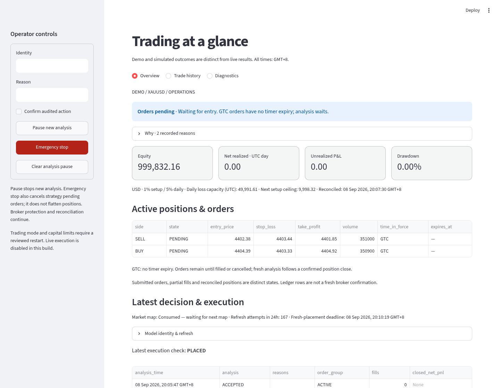

# cTrader scalper

A Debian-compatible, AI-assisted XAUUSD analysis and execution system. The model
proposes prices; deterministic code controls money, validation and execution.
**Live submission is disabled. The tested strategies have not demonstrated
positive net expectancy.**

The current source release is `0.2.5-market-stop.5`, policy `market-stop-v1`.
EPRToken returns only buy/sell stop-entry prices using `entry-pair-v2`, prioritizing
nearby M1 support/resistance and candle-based order blocks. See the
[entry guidance report](docs/nearby-order-block-report.md). The script
binds identity/time locally and calculates fee-buffered TP, double SL and position
size. Spread, ATR distance, model target-room and daily order-count filters are
removed; broker, risk, data-integrity and lifecycle requirements remain.
See [the change and retained constraints](docs/direct-entry-report.md).
Accepted STOP orders are **good till cancelled (GTC)**, without timer expiry.
The loop is analyze → pending buy/sell pair → fill/cancel peer → SL/TP close →
fresh analysis. No paid refresh runs while orders or a position are active.
Fresh placement deadlines and all risk/reconciliation gates still apply.
See [the persistent-order lifecycle and rollout](docs/persistent-order-loop-report.md).

See the [provider recovery and no-orders incident](docs/provider-recovery-report.md),
[current risk-policy and recovery report](docs/risk-budget-recovery-report.md) and
[scenario implementation evidence](docs/reusable-scenario-report.md).
The [pending-order reconciliation repair](docs/pending-order-reconciliation-report.md)
accounts for broker-reported zero P/L on unfilled orders, preventing the erroneous
immediate safety cancellation observed in `0.2.2-fixed-risk.3`.

The original [completed-candle directional research](docs/scenario-automation-report.md)
remains a separate observe/replay tool. Its hold/failed-reclaim confirmations and
simulated structural/time closes are not the production OCO trigger rule.
`npm run scenario:observe -- artifacts/scenario-observation.json` makes one
potentially chargeable observation without broker submission authority.
`npm run scenario:replay -- tests/fixtures/scenario/manual-levels-synthetic.json artifacts/scenario-replay.json`
is a synthetic software check, not evidence of strategy performance.

## Overview



The Streamlit dashboard has **Overview**, **Trade history**, and **Diagnostics**.
Overview shows operating state and reasons, fresh equity and net P&L, drawdown,
remaining budget, active exposure and the latest decision/execution. Read-only
snapshots refresh in a background worker every ten seconds; small live sections
update independently while navigation and control inputs stay in place.
Light and dark themes retain readable contrast. Financial observations older
than 30 seconds are withheld.
The overview screenshots show the current fixed-risk policy. Money values use
the policy reported by execution; missing policy data is shown as unavailable.
Prompts, analytics, provider details and infrastructure live in diagnostics.
Authenticated pause and emergency controls remain available in the sidebar.

[Trade history screenshot](docs/images/equity-sizing-history-light.png)

[Dark theme screenshot](docs/images/provider-recovery-overview-dark.png) ·
[Refresh and contrast validation](docs/dashboard-refresh-report.md)

Broker-declared holiday closures now participate in completed-candle gap checks.
Unexplained missing open-session bars still block execution. Persistence failures
are visible as **Blocked**, survive restart, and back off analysis while protective
maintenance continues. Exact chart PNGs are stored by hash in protected local
storage; back up `.runtime/analysis-charts` together with PostgreSQL.

## Safety and money management

- Paper is the default mode; emergency stop starts active and automation is off.
  Credentials never authorize demo or live trading.
- One strategy setup at a time. Other-symbol account exposure, partial fills,
  unknown orders and incomplete reconciliation block new risk. Manual orders
  are never cancelled. Maintenance selects only the configured account/symbol.
- The fixed policy permits **up to 1% total setup risk** and **5% daily loss**.
  It retains the **10-point absolute spread ceiling**, alongside ATR/percentile
  spread checks. Both OCO
  legs share the setup budget, including simultaneous-fill race exposure.
- Sizing reserves round-trip commission and ten ticks of adverse execution,
  floors broker-native volume, and respects remaining daily limits.
  No absolute starting-equity floor or artificial notional cap is required.
  Broker margin and volume limits still apply; one full modeled setup loss is
  reserved in free margin. Risk is recalculated from current equity immediately
  before placement. Collateral is distinct from stop risk. Broker margin tier changes
  trigger bounded downward sizing with exact-volume confirmation.
  Minimum volume is rejected when unaffordable. Stops cannot cap gap losses.
- Cash-flow-adjusted high-water accounting survives restarts. Drawdown/daily
  losses can reduce risk to half or quarter; a 5% drawdown lockout is durable.
  Recovery is bounded and documented in the [risk model](docs/risk-model.md).
- Protective maintenance has its own serialized two-second loop. Slow inference
  cannot block expiry, peer cancellation or recovery. Broker-held protections
  continue during model outages. Emergency stop does not flatten positions.

## Model and decision path

The operator-selected model is now `deepseek-v4-pro/u5W`. The existing EPRToken
Responses endpoint accepted this literal identifier, returning `deepseek-v4-pro`.
Every reply undergoes independent local schema and semantic validation. Both identifiers, timing and available token usage are
retained; pricing remains unknown. See [model-switch evidence](docs/deepseek-context-report.md).
No fallback model is substituted. Temperature remains omitted; the scenario
planner explicitly requests disabled thinking within the existing deadline.
`/u5W` is sent literally, without inferred client-side semantics.
Historical model observations remain immutable; a switch does not establish improved fills.

The active scenario input contains up to 240 M1, 144 M5 and 96 M15 completed
OHLCV bars as numeric data. The text-only Pro model receives no image; charts
remain verified and archived locally. New prompt `scenario-v3` uses the larger
history to distinguish nearby structure from distant levels without selecting
SL, TP or size. More history does not establish better analysis or profitability.
Every response crosses
strict schema, identity, tick-precision and fixed-validity checks. Requests have a
90-second background deadline, no automatic retry, bounded bodies and a circuit breaker.

A durable database claim prevents duplicate provider requests. Failure/unknown
dispatch retries retain a five-minute backoff; a fully reconciled position close
permits one fresh request immediately. Pending orders/open positions suppress requests. A proven local circuit block is rechecked after
one minute without bypassing earlier requests or making a paid retry. Local
execution can evaluate every five seconds (with a
five-second candle-rollover reserve), without waiting for inference. A map can
produce one OCO intent. Crossed levels, insufficient reward, short remaining
validity or consumed maps wait without another paid call. Individual decisions
still require fresh quotes, matching completed-candle context and full account,
spread, fee, margin and risk approval. A proposal must be submitted within its fresh three-minute deadline and original
map validity. Once accepted, production pending orders use GTC without timer expiry.
The [1/3/5/10/15-minute research](docs/order-expiry-research-report.md) does not
establish a profitable or optimal lifetime; filled positions retain their SL/TP.

Broker STOP_LIMIT orders handle triggers. This is retail event-triggered execution
with a polling decision loop, not institutional HFT. `DEFERRED` means waiting;
`REJECTED` retains actual validation failures. Neither means orders are open.

## Configuration and migration

The normal [.env.sample](.env.sample) has **20 settings, down from 176 (88.6%)**.
It contains deployment identity, credentials/endpoints and explicit trading authorization. Stable internals are fixed in a typed policy, not another
operator tuning file. Conflicting legacy overrides produce errors naming keys
without printing values. Broker symbol/contract metadata remains authoritative.
`AI_MODEL=deepseek-v4-pro/u5W` is explicit; other AI and strategy tuning is fixed in
code. The authorized local migration reduced the populated `.env` from **176 to
24** entries after removing the obsolete fixed-dollar notional setting, preserving all other values. Its
four additional entries preserve deployment credentials. See the
[current migration and rollout evidence](docs/equity-sizing-recovery-report.md).

For an existing installation, **do not overwrite `.env`**. Read the
[configuration inventory and migration instructions](docs/configuration.md), then:

```sh
npm ci
npm run config:check -- .env.sample
npm run config:check -- .env
npm run config:check -- .env --startup
npm run build
```

The policy check rejects conflicting legacy settings; `--startup` also checks
execution configuration, including explicit demo capital limits. Neither check
contacts the broker or authorizes trading. Keep secrets in ignored mode-0600 files
or a credential store. Migration
`0015` is additive and must be applied as a separate reviewed rollout while new
analysis is paused. Historical migrations and audit data remain intact.

Node 22 and Python 3.13 are the deployment baselines. Install Python dependencies
from `requirements.lock`. Headless services and hardened systemd units are in
[systemd/](systemd/); see [Debian deployment](docs/deployment-debian.md) and the
[operations runbook](docs/operations-runbook.md). Docker is not required.

## Reproducible research and validation

```sh
# Read-only export, scoped by existing account identity; never exports broker IDs.
npm run evaluation:export -- 0.1.0-actionable-oco-auto-demo.43 artifacts/legacy-plans.json
.venv/bin/python -m python.evaluation.cli .runtime/market-data artifacts/evaluation.json \
  --legacy-plans artifacts/legacy-plans.json --until-ms 1788743999922
# Paid, bounded inference only; local archived inputs are required.
npm run provider:benchmark -- artifacts/benchmark-inputs.json artifacts/provider-results.json
```

The quote evaluator verifies manifests, rejects unordered/nonfinite data, removes
ambiguous timestamps, uses earlier completed sampled minutes, and evaluates
frozen candidates on two chronological holdouts. It models bid/ask, execution
latency, stop-limit nonfills, adverse fills, commissions, partial-fill scenarios,
and model-cost sensitivity. Missing paths are censored; total P&L is withheld
when exposure cannot be resolved. These recordings are sampled quotes, not a
complete tick tape. M1 fixtures and smoke tests are not profitability evidence.

At audit, demo release `.43` had 23 closed trades and **−11.88 net after fees**.
The faster candidates also lost on their observed closed outcomes. Archived
legacy plans had only one holdout fill, too little for an old-versus-new strategy
conclusion. Full metrics, uncertainty, source citations and limitations are in
[the report](docs/overhaul-report.md) and [evidence](docs/evidence/quote-evaluation.json).

Run the complete gates described in [testing](docs/testing.md), including Node
and Python checks, PostgreSQL migration/integration tests, schema/fail-closed
checks, secret scanning and dependency audits. Repository delivery rules are in
[AGENTS.md](AGENTS.md) and bounded work is tracked in [plan.md](plan.md).
