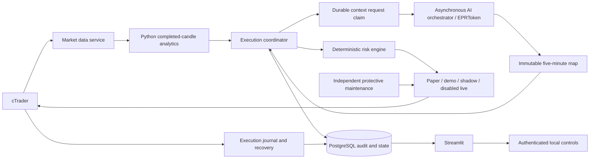

# Architecture

Current source: `0.2.2-fixed-risk.4`, fixed risk policy v2. Previous release
observations are historical evidence in `plan.md`, not the current source contract.

Production uses a five-minute immutable scenario context, a durable request journal,
and deterministic protected OCO execution. Paid inference runs separately from
execution and independent maintenance. The original directional replay remains
research-only; its confirmation/structural-close rules are distinct from OCO price
triggers. See [the integration report](reusable-scenario-report.md).

## Services and authority

Node owns broker connectivity, stateful coordination and risk. Python owns
analytics/replay and presentation. Communication with analytics is typed local
HTTP, not a shell pipeline. No service requires Docker; listeners default to
loopback and deployments support Debian/systemd.

## Data to order trace

1. `packages/ctrader-client` authenticates, renews tokens, discovers account and
   symbol metadata, and maintains quote/depth subscriptions. It validates weekly
   broker sessions. Unknown holiday gaps remain fail-closed.
2. `apps/market-data-service` exposes typed snapshots and quotes. Source,
   receipt and capture times are distinct. Recording is a bounded local cache
   sampler, not a complete tick feed. Freshness/order checks precede writes;
   gzip segments carry checksum/count manifests and bounded retention.
3. `python.analytics` validates completed M1/M5/M15 candles, alignment, depth
   and canonical decimal strings. Full 600/500/300 histories feed indicators;
   bounded numerical features/raw tails and a deterministic chart are produced.
4. `coordinator.ts` records completed-candle provenance and checks safety,
   spread, account, affordable stops and fee coverage before a refresh can start.
   Five-second broker-time claims admit local decisions; the final five seconds
   before M1 rollover are reserved. `DEFERRED` is terminal waiting with a separate
   deferral reason; actual validation failures remain `REJECTED`.
5. `scenario-context.ts` claims at most one refresh per account/symbol/mode per
   five minutes using a transaction/advisory lock. The source analysis links the
   archived chart and market inputs. A separate task calls `/v1/scenario`, using
   exact `gpt-6-astra/u64`, prompt `scenario-v2`, strict `scenario-1.0`, chart and
   bounded candle tails. Completion/failure and usage are durable. An interrupted
   request is not retried during its cooldown, because provider acceptance is unknown.
6. `ScenarioHttpPlanner` independently validates raw JSON, identity, prompt hash,
   timing, model request pin and telemetry. `scenarioOco` derives a schema-2.1 pair
   from an unconsumed map. Thresholds are not chased; distant entries, insufficient
   reward or short remaining validity defer. Each local decision still uses fresh
   quotes and unchanged completed-candle context checks across its own short path.
   `model_requests.decision_source` distinguishes local artifacts from paid calls;
   real refresh attempts live in `scenario_contexts`.
7. The existing fee-buffered TP / double-SL transform is recorded separately from
   immutable model output. Bound arithmetic projects inward onto the pip grid;
   no broker price or untrusted model value is rounded into acceptance.
8. `risk-engine` sizes both race-exposed legs with cost reserves, current equity,
   the fixed 1% setup ceiling, remaining 5% daily budget, durable capital risk, broker volume steps, currency
   conversion, exact margin estimates and notional limits. It never rounds up to
   minimum volume. Existing/unpriced account exposure blocks replacement.
9. Account and market data are refreshed again; changes invalidate the plan.
   Final risk-cap reductions also reject previously sized commands. A unique
   `order_groups.context_plan_id` consumes each map at intent, even when broker
   submission later fails or becomes uncertain. Transactional
   idempotent intent precedes gateway calls. cTrader STOP_LIMIT entries and
   fill-relative protections handle the immediate broker event path.
10. Broker events are durably deduplicated/mapped. Unknown, partial, conflicting
    or incomplete outcomes remain reconciliation blockers. Existing recovery
    handles duplicate callbacks, peer-cancel retries and both OCO legs filling.

Account P/L matching requires exactly one row per open position. This broker also
reports zero P/L for the position identities reserved by pending orders. Such a
row is valid only when gross and net are both zero and its identity matches exactly
one accepted order with explicit zero executed volume. These orders remain counted
as pending exposure; other-symbol exposure still blocks. Unknown, duplicate,
nonzero unmatched, partial and missing open-position evidence reject. Known account
failure codes are retained in status/logs without raw exceptions. See
[the reconciliation report](pending-order-reconciliation-report.md).

## Independent protective path

`IndependentMaintenance` serializes the two-second maintenance loop separately
from the analysis promise. It runs expiry, journal recovery, peer cancellation,
and authenticated/file/environment emergency checks while a model call is in
flight. Maintenance SQL is scoped to the exact account and symbol and selects
strategy-owned orders only. Shutdown drains the maintenance promise before
closing broker/database resources. Broker stops do not depend on this process.

This separation removes an avoidable inference/maintenance coupling. It does
not relax order admission, candle validity, expiry or reconciliation.

## Persistence and boundaries

The immutable strategy-definition hash excludes the operational scheduler-enabled
flag. Full safety/control audit hashes still include it; all economic parameters
remain in both hashes. Activation therefore does not redefine strategy economics,
while altered risk or notional parameters still require a new release identity.

PostgreSQL is authoritative for intervals, intents, groups, orders, fills,
positions, trades, daily accounting, runtime controls and audit events. Migration
0015 adds provider telemetry/failures and durable capital state. Models cannot
write those controls. Financial boundaries use decimal strings; prices and money
use Decimal arithmetic. Daily utilization rounds conservatively to eight decimal
places, matching storage instead of emitting unbounded recurring decimals.

Successful provider calls retain requested/returned identifiers and usage;
failed calls retain requested model, bounded reason and elapsed time. A failed
call has no trusted returned-model/usage record. Pricing is unverified and stays
unavailable. Prompts/charts and legacy evidence remain auditable even when the
new structured input profile omits the chart from the provider request.

The dashboard exposes a compact overview and mode/account/symbol-scoped history.
Diagnostics lazily render selected detailed views. Financial freshness is explicit;
missing capital-policy telemetry on an older deployment is not inferred. Pause
and emergency actions require a separate token and durable audit.

Overview/history snapshots are read by a cached worker per view, with one in-flight
read and ten-second admission intervals. Rendering polls completion without waiting
on network/database work. Two-second fragments emit stable keyed live sections;
the title, navigation and control form remain outside the timer. Observation age
starts before IO and values older than 30 seconds are withheld. Failed reads clear
the previous display value. The workers never call Streamlit, execute orders or
send controls. Diagnostics retain the user's selected snapshot during recovery.

## Modes and remaining limits

Paper uses its own account identity/ledger; demo requires explicit acknowledgement
and notional authorization. No absolute equity floor is required. Shadow has a non-submitting gateway. Live uses
`DisabledLiveGateway` and cannot place orders in this composition. Credentials
cannot select mode or authorize execution.

Current research does not establish an economic benefit from the five-second
local cadence or justify directional/single-leg production contracts. Schema 2.1 remains a two-leg proposal; uncertainty
is rejected deterministically when safety/validation fails. Full tick history,
prospective model ablation and broker-specific partial/multiple-close validation
remain readiness work. See `overhaul-report.md` and `risk-model.md`.
