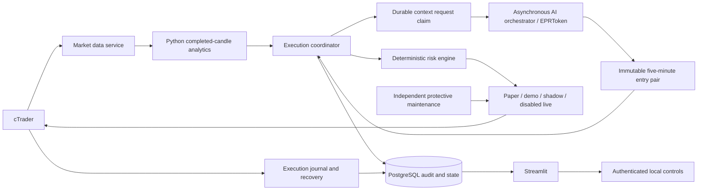

# Architecture

Current source: `0.2.5-market-stop.5`, policy `market-stop-v1`.

Production uses `/v2/entry-pair`, a two-price provider reply and locally
bound `entry-pair-1.0` journal context. Spread/ATR/target-room/count selection
filters are removed. The older scenario-map contracts remain available for
history/research. Production details and retained broker/risk/data requirements
are specified in [the direct-entry report](direct-entry-report.md). Previous release
observations are historical evidence in `plan.md`, not the current source contract.

Production uses a fresh five-minute entry-pair context, a durable request journal,
and deterministic protected OCO execution. Paid inference runs separately from
execution and independent maintenance. The original directional replay remains
research-only; its confirmation/structural-close rules are distinct from OCO price
triggers. See [the integration report](reusable-scenario-report.md).

## Services and authority

Node owns broker connectivity, stateful coordination and risk. Python owns
analytics/replay and presentation. Communication with analytics is typed local
HTTP, not a shell pipeline. No service requires Docker; listeners default to
loopback and deployments support Debian/systemd.

## Data to order trace

1. `packages/ctrader-client` authenticates, renews tokens, discovers account and
   symbol metadata, and maintains quote/depth subscriptions. It validates weekly
   broker sessions. Validated broker holiday overrides use their declared date, recurrence and timezone. Unexplained gaps remain fail-closed.
2. `apps/market-data-service` exposes typed snapshots and quotes. Source,
   receipt and capture times are distinct. Recording is a bounded local cache
   sampler, not a complete tick feed. Freshness/order checks precede writes;
   gzip segments carry checksum/count manifests and bounded retention.
3. `python.analytics` validates completed M1/M5/M15 candles, alignment, depth
   and canonical decimal strings. Full 600/500/300 histories feed indicators;
   numeric analytics 2.0 returns bounded numerical features/raw tails without
   rendering a PNG. Historical image contracts remain available.
4. `coordinator.ts` records completed-candle provenance and checks account state,
   executable quotes, affordable stops and fee coverage before a refresh can start.
   Production does not apply spread or ATR strategy limits.
   Five-second broker-time claims admit local decisions; the final five seconds
   before M1 rollover are reserved. `DEFERRED` is terminal waiting with a separate
   deferral reason; actual validation failures remain `REJECTED`.
5. `scenario-context.ts` claims at most one potentially dispatched refresh per account/symbol/mode per
   five minutes using a transaction/advisory lock for failed/unknown or unconsumed contexts.
   A uniquely claimed post-close or proven zero-fill cancellation request can start earlier after complete terminal evidence; active groups prohibit requests. The source analysis links
   the recorded numeric market inputs. A separate task calls `/v2/entry-pair`, using
   exact `deepseek-v4-pro/u5W`, prompt `entry-pair-v2`, two readable prices, and
   structured completed-candle tails (M1 240 / M5 144 / M15 96). The text-only
   model receives no image; exact provider input, prompt and available output are
   durably journaled. Historical chart bytes remain protected. Completion/failure
   and usage are durable. An interrupted
   request is not retried during its cooldown, because provider acceptance is unknown.
   Previous-model maps remain audited but cannot authorize new execution; the same
   account/symbol/mode cooldown survives a model change.
6. `EntryPairHttpPlanner` independently reads the raw prices, binds local identity
   and time, and checks the internal prompt hash, requested pin and telemetry.
   Returned model identity is recorded without gating entry acceptance.
   `scenarioOco` uses the unconsumed entry prices directly in a schema-2.1 pair;
   its technical-map fields describe mechanical order geometry. No ATR corridor
   or model target-room check applies. Wrong-side prices, unaffordable local exits
   and short remaining validity can still block placement. Each local decision uses fresh
   quotes and unchanged completed-candle context checks across its own short path.
   `model_requests.decision_source` distinguishes local artifacts from paid calls;
   real refresh attempts live in `scenario_contexts`.
7. The existing fee-buffered TP / double-SL transform is recorded separately from
   immutable model output. Bound arithmetic projects inward onto the pip grid;
   no broker price or untrusted model value is rounded into acceptance.
8. `risk-engine` sizes both race-exposed legs with cost reserves, current equity,
   the fixed 1% setup ceiling, remaining 5% daily budget, durable capital risk, broker volume steps, currency
   conversion and exact margin estimates. Free margin reserves one modeled setup loss;
   there is no artificial notional or 1% collateral ceiling. It never rounds up to
   minimum volume. Existing/unpriced account exposure blocks replacement.
9. Account/capital safety and account state are refreshed before the final market
   snapshot; changes invalidate the plan. Cheap authorization controls are read
   again after semantic checks. Final admission preserves blockers from both
   safety and account observations; no newer exposure/uncertainty is overwritten.
   Final risk-cap reductions also reject previously sized commands. A unique
   `order_groups.context_plan_id` consumes each map at intent, even when broker
   submission later fails or becomes uncertain. Transactional
   idempotent intent precedes gateway calls. cTrader STOP entries and
   fill-relative protections handle the immediate broker event path.
10. Broker events are durably deduplicated/mapped. Unknown, partial, conflicting
    or incomplete outcomes remain reconciliation blockers. Existing recovery
    handles duplicate callbacks, peer-cancel retries and both OCO legs filling.

Account P/L matching requires exactly one row per open position. This broker also
reports zero P/L for the position identities reserved by pending orders. Such a
row is valid only when gross and net are both zero and its identity matches exactly
one accepted order with explicit zero executed volume. These orders remain counted
as pending exposure; other-symbol exposure still blocks. Unknown, duplicate,
nonzero unmatched, partial and missing open-position evidence reject. Known account
failure codes are retained in status/logs without raw exceptions. See
[the reconciliation report](pending-order-reconciliation-report.md).

## Nearby entry guidance (ISSUE-092)

`ENTRY_PAIR_PROMPT` is the single path/version used by provider dispatch, the HTTP
consumer and pre-dispatch evidence. Prompt v2 prioritizes the latest 5 of 10
completed M1 candles for tight support/resistance and uses candle-based order
blocks as confluence. Older timeframes remain background context. Stops remain
breakout entries outside nearby structure, not pullback limits inside blocks.
This adds no runtime structure detector, distance rejection, price clamping or
timed refresh. Historical v1 prompt bytes, JSON contracts, GTC/OCO and dynamic
sizing are unchanged. See [definitions and evidence](nearby-order-block-report.md).

## Independent protective path

`IndependentMaintenance` serializes the two-second maintenance loop separately
from the analysis promise. It runs expiry, journal recovery, peer cancellation,
and authenticated/file/environment emergency checks while a model call is in
flight. Maintenance SQL is scoped to the exact account and symbol and selects
strategy-owned orders only. Shutdown drains the maintenance promise before
closing broker/database resources. Broker stops do not depend on this process.

This separation removes an avoidable inference/maintenance coupling. It does
not relax order admission, candle validity, expiry or reconciliation.

## Persistence and boundaries

The immutable strategy-definition hash excludes the operational scheduler-enabled
flag. Full safety/control audit hashes still include it; all economic parameters
remain in both hashes. Activation therefore does not redefine strategy economics,
while altered risk or notional parameters still require a new release identity.

PostgreSQL is authoritative for intervals, intents, groups, orders, fills,
positions, trades, daily accounting, runtime controls and audit events. Migration
0015 adds provider telemetry/failures and durable capital state. Models cannot
write those controls. Financial boundaries use decimal strings; prices and money
use Decimal arithmetic. Daily utilization rounds conservatively to eight decimal
places, matching storage instead of emitting unbounded recurring decimals.

Successful provider calls retain requested/returned identifiers and usage;
failed calls retain requested model, bounded reason and elapsed time. A failed
call has no trusted returned-model/usage record. Pricing is unverified and stays
unavailable. Prompts/charts and legacy evidence remain auditable even when the
new structured input profile omits the chart from the provider request.

The dashboard exposes a compact overview and mode/account/symbol-scoped history.
Diagnostics lazily render selected detailed views. Financial freshness is explicit;
missing capital-policy telemetry on an older deployment is not inferred. Pause
and emergency actions require a separate token and durable audit.

Overview/history snapshots are read by a cached worker per view, with one in-flight
read and ten-second admission intervals. Rendering polls completion without waiting
on network/database work. Two-second fragments emit stable keyed live sections;
the title, navigation and control form remain outside the timer. Observation age
starts before IO and values older than 30 seconds are withheld. Failed reads clear
the previous display value. The workers never call Streamlit, execute orders or
send controls. Diagnostics retain the user's selected snapshot during recovery.

## Modes and remaining limits

Paper uses its own account identity/ledger; demo requires explicit acknowledgement
and fixed equity-relative loss limits. No absolute equity floor is required. Shadow has a non-submitting gateway. Live uses
`DisabledLiveGateway` and cannot place orders in this composition. Credentials
cannot select mode or authorize execution.

Current research does not establish an economic benefit from the five-second
local cadence or justify directional/single-leg production contracts. Schema 2.1 remains a two-leg proposal; uncertainty
is rejected deterministically when safety/validation fails. Full tick history,
prospective model ablation and broker-specific partial/multiple-close validation
remain readiness work. See `overhaul-report.md` and `risk-model.md`.

## ISSUE-079 storage and operational recovery

The risk engine allocates half the available combined margin to each OCO leg before
sizing. Exact broker margin at the candidate volume may cause at most two additional
downward recalculations; only a confirmed affordable pair proceeds. Fresh account
fingerprints are checked again before placement. Costs, losses and volumes use Decimal.

Migration 0018 adds `storage_kind` to chart artifacts. Existing rows retain database
bytes; new rows refer to the exact PNG by SHA-256 in `.runtime/analysis-charts`.
The file is flushed and hash-verified before the database pointer commits. Dashboard
reads recheck dimensions/hash and reject missing, corrupt or redirected files.
Unchanged completed-candle inputs now produce the same chart despite a later capture
time; the exact analysis timestamp stays in the journal. An uncommitted file can be
an orphan, never a valid order or chart pointer. No financial rows are deleted.

A protected local operational-failure latch reports scheduler/storage errors across
restarts, returns HTTP 503 readiness and blocks manual cycle requests. Automatic
analysis retries at most once a minute; only a completed durable cycle clears it.
Spread writes respect the same backoff. Independent protective maintenance retains
its two-second schedule and all durable-write requirements.

## ISSUE-080 provider recovery

The scenario client now has a 90-second deadline with a 95-second HTTP envelope.
Original five-minute map expiry and the minimum remaining execution lifetime are
unchanged. Failed/unknown requests consume the full five-minute dispatch budget.
Only a known local circuit rejection can recheck after one minute; SQL admission
checks every earlier potentially dispatched request and separately enforces the
one-minute local floor under the existing scope lock. No journal rows are rewritten.
The sell constructor checks its fixed cost-buffered TP against the first actual
downside target, matching the buy constructor. It never treats the intermediate
extension trigger as a target or skips the first target to obtain more room.
Provider work remains detached from protective order maintenance. The AI readiness
endpoint checks the active scenario client, and dashboard entry availability is
distinct from process health, broker exposure, and local execution checks.

## ISSUE-082 pending validity

New local OCO proposals prefer 180 seconds and expire at the earlier of that
deadline and their immutable map deadline. The requested duration is validated
before capping; fewer than 60 seconds remaining causes a refresh wait. Schema 2.1
and the five-minute map schema/database constraint stay unchanged. An accepted
pending order keeps its original expiry through maintenance/reconciliation;
expiry never closes a filled position. Ten/fifteen-minute expiry comparisons
are isolated research cohorts with no broker authority.

## ISSUE-083 persistent order loop

The provider still returns immutable schema-1.0 levels and bounded placement validity.
Local execution artifact v2 and trusted `ORDER_LIFECYCLE` select GTC independently of
model output. Command `expiresAt` remains the submission deadline; optional
`timeInForce` defaults to historical GTD only for legacy callers. Production sets
GTC explicitly. `pending-order-lifetime-1.0.json` documents the durable projection:
GTC has null pending expiry plus a required `submission_valid_until`; GTD retains
its original dated expiry. Migration 0019 transitions history without changing it.

Maintenance only expires GTD. Normal shutdown preserves GTC; emergency/risk
cancellation and OCO fill cancellation retain authority. Account and journal
exposure gates suppress new analysis while either orders or a position remain.
After complete durable closure, `refresh_after_context_id` permits one immediate
fresh request under the same scope/advisory lock, across concurrent processes and
restarts. Failed/unknown requests retain bounded backoff. A close never reuses the
old map. Unfilled broker cancellation uses normal recovery/backoff.

ISSUE-084 cancels an owned survivor after one broker-confirmed zero-fill terminal
leg and waits for reconciled cleanup before ordinary fresh analysis. Intact GTC
pairs have no timer expiry. Durable peer-cancel retries include partial fills.
See [recovery evidence](oco-pair-recovery-report.md).

## ISSUE-087 ordinary STOP execution

Production sends explicit `STOP` (broker enum 3), GTC, trade-side trigger and local
relative SL/TP; no limit/slippage ceiling is attached. An additive execution intent
column distinguishes new STOP/STOP_LIMIT commands. Historical generic STOP rows
retain null explicit type and immutable broker event history; no classification is
invented. Legacy stop-limit placement/recovery remains available internally.

The shared terminal-proof SQL is used both when finding a consumed context and
inside its locked dispatch claim. Zero-fill restarts require both owned orders to
have matching mapped terminal broker events, zero fills, no positions/trades and
no unresolved event uncertainty. A five-second local poll discovers new terminal
state even while the paid-request cooldown was previously cached. All provider
failure/unknown backoff and active-group prohibitions remain. See
[implementation and evidence](market-stop-report.md).

### Filled-position protection (ISSUE-089)

Release `0.2.5-market-stop.3` independently reconciles owned demo positions every
maintenance cycle. Durable broker observations retain actual SL/TP and timestamps.
Approved distances are anchored to actual fill VWAP, rounded inward, preserving
tighter protection. At most two durable amendment attempts repair missing/wider
levels. Verified protection returns without fetching a quote; broker SL/TP handles
exits. Failed/exhausted repairs remain visible without a local market close or
persistent analysis pause. Historical close claims still require deal evidence.
The worker has no close or pause authority, and does not add a global entry lock.
Existing ownership, open-position, reconciliation and risk gates remain. A fully
reconciled close admits the existing fresh-context cycle. See
[implementation and evidence](broker-exit-loop-report.md).

## ISSUE-090 local evidence storage

Release `0.2.5-market-stop.4` adds a versioned numeric analytics route:
`POST /v2/analyze-numeric` accepts `{schemaVersion: "2.0", request: <1.0 request>}`
and returns strict analytics 2.0 with `artifactPolicy: "numeric-v1"`, the same
quality/feature computations and `chart: null`. Production entry inference uses
`POST /v2/entry-pair`. Legacy image routes and schemas remain unchanged. Candles,
quote/depth freshness and completed-bar validation remain mandatory.

Migration 0023 stores typed immutable candle values once, with separate snapshot
references retaining IDs and capture/source provenance. `decision_candles` reads
both legacy and normalized storage. Exact provider user JSON and the actual
provider prompt are committed with the dispatch claim; completion atomically
journals the plan/telemetry and available response text, including rejected
output. Redaction still protects secrets. Historical missing text is not invented.

Future numeric analyses create no automatic PNG. Diagnostics can render recorded
candles on demand and label them regenerated. Historical PNGs still use their
original hashes and bytes. Native PostgreSQL and local artifacts form a paired
backup; routine storage maintenance has no provider/broker authority. See
[transition, retention, recovery and current blocker](local-storage-report.md).

Sampled-segment `startedAt` is the recorder's bucket boundary, not a promise that
the first sample occurs exactly there. Archival verification preserves that bound,
strict capture ordering, exact completion/count and byte hashes; late first
captures do not imply a complete tick tape.

ISSUE-091 activates this storage release in a separate local demo accounting
epoch, following explicit operator reset authorization. Historical recovery stays
separate from current execution. The existing per-setup dynamic risk engine and
durable reduction/lock behavior are unchanged. See
[the activation evidence](fresh-local-demo-report.md).
