# Current data flow

```mermaid
flowchart LR
  Broker[cTrader spot/depth and completed bars] --> Market[Validated market snapshots]
  Market --> Analytics[Typed HTTP completed-candle analytics]
  Analytics --> Claims[Durable M1 claim and deterministic preflight]
  Claims --> Model[EPRToken bounded structured proposal]
  Model --> Validate[Schema and semantic validation]
  Validate --> Refresh[Fresh quote / account / metadata checks]
  Refresh --> Risk[Cost-inclusive shared OCO risk budget]
  Risk --> Intent[Durable idempotent intent]
  Intent --> Orders[Broker STOP_LIMIT and protective SL/TP]
  Orders --> Journal[Callbacks / reconciliation / durable journal]
  Journal --> Capital[Daily flows / high water / risk reductions]
  Capital --> Claims
  Journal --> UI[Overview / history / diagnostics]
  Market --> Recorder[Timestamped sampled quotes and checksums]
  Recorder --> Research[Chronological research with censored gaps]
```

Inference is awaited by the analysis cycle, but independent serialized maintenance
and broker callbacks continue expiry, cancellation, paper quote processing and
recovery. The model does not call order placement, choose size or change authority.
Both the post-model and pre-placement refresh must preserve the completed-candle
context and current metadata; expired/invalidated plans are never extended.

Market snapshots, feature inputs, immutable prompt artifacts, original proposals,
effective exits, risk decisions, commands, callbacks and terminal trades preserve
their distinct durable identities. Migration `0015` adds provider usage/failure
telemetry and account-scoped capital state. Read-only dashboard queries distinguish
account, symbol and mode and withhold unavailable current financial state.

See `architecture.md`, `risk-model.md`, `model-contract.md` and `overhaul-report.md`
for bounded contracts, measurements, failure behavior and known limitations.
